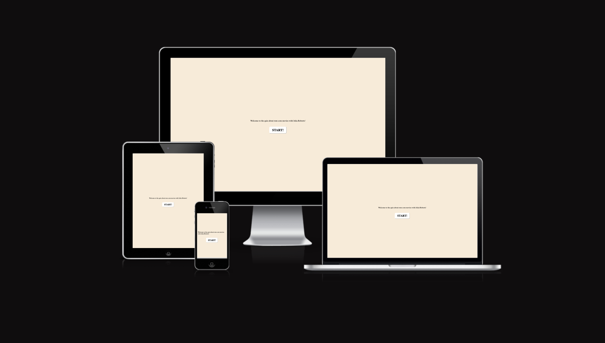
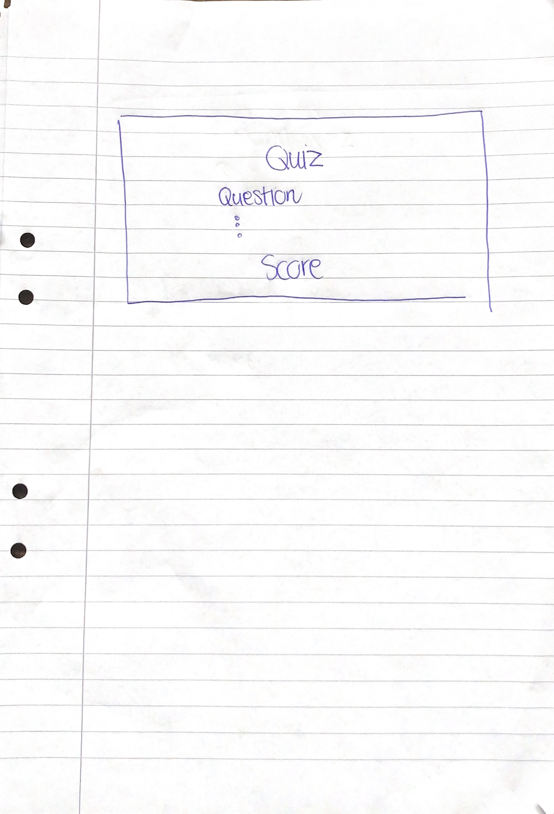
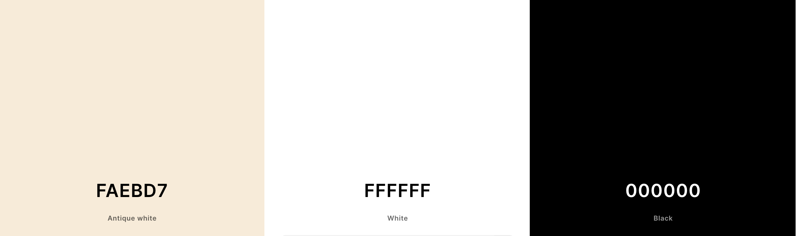
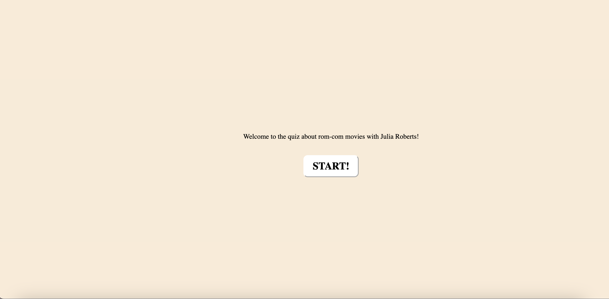
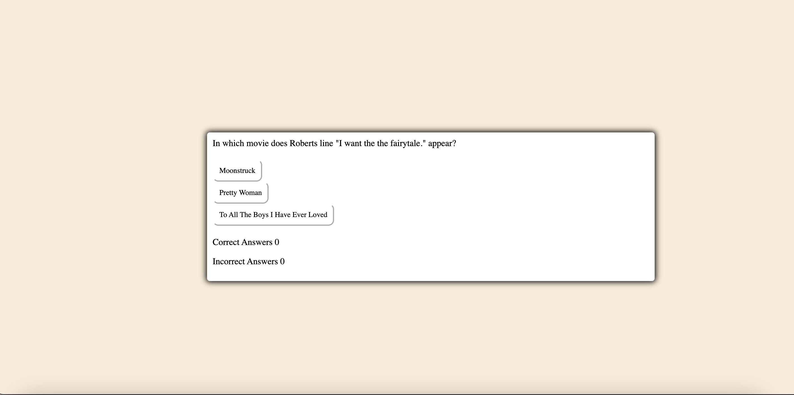
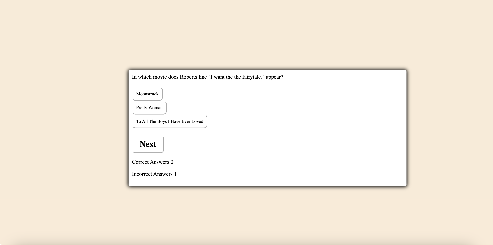
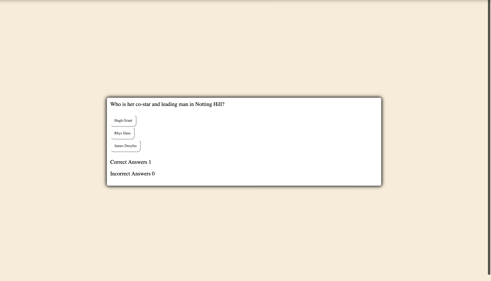
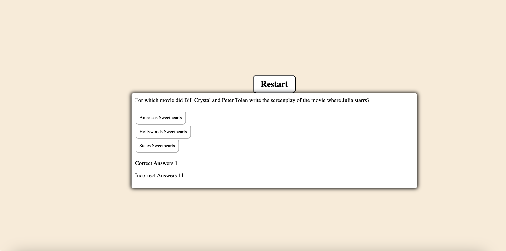

# [QUIZ ROMCOM](https://ilswh.github.io/quiz-romcom)

I have made a quiz about romcom-movies starring Julia Roberts.

I hope that this quiz will bring back some happy memories, ... and a sense of accomplishment.
The quiz is targetet towards romcom-nerds or even just trivia-lovers.
My hope is that it will be useful for these people just by reminding them of something that makes them happy.

https://ui.dev/amiresponsive?url=https://ilswh.github.io/quiz-romcom

## UX

My design process started with a sketch on paper with pen. A quite simple one. 

And as I had a bit time, I decided to add a scoreboard and welcoming text before entering the game.

### Colour Scheme

I chose black and white for clarity and antique white as a background color to create a warmth that exist i romantic movies.

https://coolors.co/faebd7-ffffff-000000

### Typography

As font I chose serif because of my preference and have the cozyness of a book.

## Features

I have five features. First is the startbutton and the introduction. Secondly is the quiz that consist of 12 questions which each has 3 options. Thirdly is the next-button which takes you to a new question.  Fourth is the scoreboard that keeps track of how many right and wrong answers the user have made.. The fifth feature is the restart feature which becomes availble after going through all 12 questions.

### Existing Features

- **Introduction with start-button**

    - This is the introduction the the site and it gives the option to start the quiz.

- **Quiz**

    - The quiz is the main content and of biggest value of the site. The quiz is what is suppose to capture the interest of the user and make the romcom-fan intrigued.

- **Next-button**

    - The next button makes it possible for the user to move on to the next question.

- **Scoreboard**

    - Shows the user if they answered correct or wrong and keeps count of how many correct answers and how many wrong answer you have made.

- **Restart**

    - Appears for the user to restart the game after finishing all 12 questions.

### Future Features

- Radio unordered list
    - Put the options of the arrays from each question in and unordered list and radio buttons, so it becomes more clear which option the user has chosen.
- Questions based on a picture
    - Instead of a question, a picture or screenshot of the movie will be shown and the user gets to guess which movie the picture is from.
- Book-browser before entering the game
    - When clicking start you see a browsing of a book happening with pictures and text with J.R's rom-com characters.
- Funny set-stories
    - In the nav-bar there will be a option to click on set-stories and there will you can read small anecdotes with funny things that happend on set.

## Tools & Technologies Used

- [HTML](https://en.wikipedia.org/wiki/HTML) used for the main site content.
- [CSS](https://en.wikipedia.org/wiki/CSS) used for the main site design and layout.
- [CSS Flexbox](https://www.w3schools.com/css/css3_flexbox.asp) used for an enhanced responsive layout.
- [CSS Grid](https://www.w3schools.com/css/css_grid.asp) used for an enhanced responsive layout.
- [JavaScript](https://www.javascript.com) used for user interaction on the site.
- [Git](https://git-scm.com) used for version control. (`git add`, `git commit`, `git push`)
- [GitHub](https://github.com) used for secure online code storage.
- [GitHub Pages](https://pages.github.com) used for hosting the deployed front-end site.
- [Gitpod](https://gitpod.io) used as a cloud-based IDE for development.

## Testing

For all testing, please refer to the [TESTING.md](TESTING.md) file.

## Deployment

The site was deployed to GitHub Pages. The steps to deploy are as follows:

- In the [GitHub repository](https://github.com/ilswh/quiz-romcom), navigate to the Settings tab 
- From the source section drop-down menu, select the **Main** Branch, then click "Save".
- The page will be automatically refreshed with a detailed ribbon display to indicate the successful deployment.

The live link can be found [here](https://ilswh.github.io/quiz-romcom)

### Local Deployment

This project can be cloned or forked in order to make a local copy on your own system.

#### Cloning

You can clone the repository by following these steps:

1. Go to the [GitHub repository](https://github.com/ilswh/quiz-romcom) 
2. Locate the Code button above the list of files and click it 
3. Select if you prefer to clone using HTTPS, SSH, or GitHub CLI and click the copy button to copy the URL to your clipboard
4. Open Git Bash or Terminal
5. Change the current working directory to the one where you want the cloned directory
6. In your IDE Terminal, type the following command to clone my repository:
	- `git clone https://github.com/ilswh/quiz-romcom.git`
7. Press Enter to create your local clone.

Alternatively, if using Gitpod, you can click below to create your own workspace using this repository.

Please note that in order to directly open the project in Gitpod, you need to have the browser extension installed.
A tutorial on how to do that can be found [here](https://www.gitpod.io/docs/configure/user-settings/browser-extension).

#### Forking

By forking the GitHub Repository, we make a copy of the original repository on our GitHub account to view and/or make changes without affecting the original owner's repository.
You can fork this repository by using the following steps:

1. Log in to GitHub and locate the [GitHub Repository](https://github.com/ilswh/quiz-romcom)
2. At the top of the Repository (not top of page) just above the "Settings" Button on the menu, locate the "Fork" Button.
3. Once clicked, you should now have a copy of the original repository in your own GitHub account!

## Credits

In this section you need to reference where you got your content, media, and extra help from.
It is common practice to use code from other repositories and tutorials,
however, it is important to be very specific about these sources to avoid plagiarism.

### Content

| Source | Location | Notes |
| --- | --- | --- |
| [Markdown Builder](https://tim.2bn.dev/markdown-builder) | README and TESTING | tool to help generate the Markdown files |
| [W3Schools](https://www.w3schools.com/howto/howto_js_topnav_responsive.asp) | entire site | responsive HTML/CSS/JS navbar |
| [Flexbox Froggy](https://flexboxfroggy.com/) | entire site | modern responsive layouts |
| [Grid Garden](https://cssgridgarden.com) | entire site | modern responsive layouts |
| [Youtube] | https://www.youtube.com/watch?v=riDzcEQbX6k | entire site | how to make a javascript quiz |

### Acknowledgements

- I would like to thank my Code Institute mentor, [Tim Nelson](https://github.com/TravelTimN) for their support throughout the development of this project.
- I would like to thank the [Code Institute](https://codeinstitute.net) tutor team for their assistance with troubleshooting and debugging some project issues.
- I would like to thank the [Code Institute Slack community](https://code-institute-room.slack.com) for the moral support; it kept me going during periods of self doubt and imposter syndrome.
- I would like to thank my mom, for believing in me, and allowing me to make this transition into software development.
